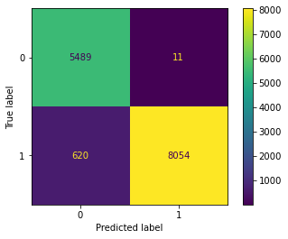
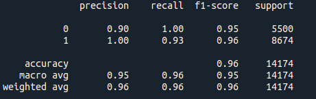
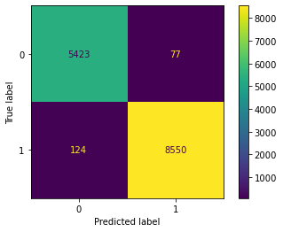
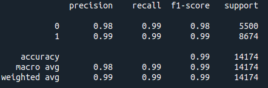

Dataset Source
==============

1.  [**https://spamassassin.apache.org/old/publiccorpus/**](https://spamassassin.apache.org/old/publiccorpus/)

2.  [**http://nlp.cs.aueb.gr/software\_and\_datasets/Enron-Spam/index.html**](http://nlp.cs.aueb.gr/software_and_datasets/Enron-Spam/index.html)

3.  [**https://www.kaggle.com/ozlerhakan/spam-or-not-spam-dataset**](https://www.kaggle.com/ozlerhakan/spam-or-not-spam-dataset)

Data Pre-processing
===================

We have used datasets from multiple sources to build and validate the spam classifier. We have performed the following pre-processing steps on the dataset.

Email Cleaning (removing unnecessary content)
---------------------------------------------

The raw dataset contains multiple emails, which include the headers. We have retained each mail’s subject and body in the dataset and removed the other lines for efficient classification.

Removing punctuation and numbers
--------------------------------

Punctuation are generally used for improving the clarity for human readers, yet they don’t change the underlying meaning. But they do not provide much information for machine learning algorithms. So we have removed the punctuation. We have also removed the numbers.

Lowercase
---------

The model doesn’t need to distinguish the lowercase and uppercase characters, treating ’Write’ and ’write’ as different words. Hence, we want to convert all the uppercase words into lowercase words. Otherwise, ’Write’ and ’write’ will be considered different features that may affect the classifier’s performance.

Remove stopwords
----------------

Stopwords are words that do not add any significance to a statement. They consist of articles, prepositions, pronouns, question words, and helping verbs (i.e., in, the, an, is). Hence, we have removed these words.

Remove whitespaces
------------------

Whitespaces like space, newline, and carriage return do not provide any useful information for spam classification. So, we have replaced multiple spaces with a single space and removed all the other whitespaces.

Lemmatization
-------------

Words like writes, wrote, and writing all are from the same root word (write). Lemmatization converts the words to their base words by morphological analysis. We have used the nltk library for this process.

Data Modeling
=============

Spam classifier is a supervised learning problem. Though there are various supervised learning algorithms, we have used the Naive Bayes and Support Vector Machine algorithm for this problem. The reason for choosing these algorithms and the implementation methodology is explained in this section. Among the three datasets (mentioned in Section 1), we have used complete dataset one and a part of dataset two for training and the rest of the dataset for validation. The training data contained around 30k emails and the validation data contained around 15k emails.

Naive Bayes
-----------

Naive Bayes is a probabilistic algorithm that does highly effective learning and prediction. It assumes the conditional independence between every pair of features given the label. The Naive Bayes algorithm is simple to implement because of its naive assumption. The training time of the Naive Bayes is shorter when compared with other algorithms. Despite its over-simplified assumption, Naive Bayes works well in practice that too for document classification tasks.

### Data distribution

Multinomial Naive Bayes considers the frequency count of the features (words), while Bernoulli Naive Bayes cares only about the presence or absence of a particular feature (word) in the document. The latter is adequate for binary features. Whereas, in Gaussian Naive Bayes, features are real-values, and their distribution is Gaussian. We have decided to use the frequency of words as features, and hence the distribution of data will be multinomial. We have used CountVectorizer of sklearn for feature extraction.

\[\begin{gathered}
    P(Spam | w_1, w_2,...,w_d) \propto P(Spam) * \Pi_{i=1}^{d} P(w_i | Spam) \\ \\
    P(w_i\ |\ Spam) = \frac{Number\ of\ times\ w_i\ appears\ in\ all\ spam\ emails}{Total\ number\ of\ words\ in\ all\ spam\ emails}\end{gathered}\]

### Laplace smoothing

If a word is not present in any of the emails in a particular class, then the probability of any email in that class to belong to that class is zero because of the product. This one feature nullifies the significance of other features. This can be avoided by a technique called smoothing.

\[\begin{gathered}
    P(w_i\ |\ Spam) = \frac{Number\ of\ times\ w_i\ appears\ in\ all\ spam\ emails + \alpha }{Total\ number\ of\ words\ in\ all\ spam\ emails + \alpha * Number\ of\ features}\end{gathered}\]

If we choose a value of \(\alpha > 0\), the probability will no longer be zero even if a word is not present in an entire class of emails. When \(\alpha = 1\), then it is called Laplace smoothing. We included Laplace smoothing as part of our implementation.

### Results

The performance of the model is evaluated using confusion matrix and other performance metrics.

 [a]

 [a]

Support Vector Machine
----------------------

Super Vector Machine is a deterministic algorithm, unlike Naive Bayes. SVM builds a classifier by searching for a separating optimal hyperplane and maximizes the margin that separates the classification categories. We built this model using Python Sklearn library. We have used TFIDF(Term Frequency - Inverse Document Frequency) vectorizer of sklearn for feature extraction. Word frequency as features has the problem that commonly occurring words will have high frequency irrespective of their significance. But TFIDF reduces the weight of high frequency terms by the number of documents that contain the term.

### Parameters

**Kernel:**
There are various kernel functions available in the sklearn library. We tested the model using polynomial, radial basis function(rbf), and sigmoid kernel functions. We found that the sigmoid kernel function gives the best results. Hence, we have used the sigmoid function as the kernel for comparison with Naive Bayes.

**Class weight:** The class\_weight parameter of SVM classifier is set to ’balanced’. With this setting, sklearn will automatically adjust the class weights inversely proportional to class frequencies. This will help when the input data in imbalanced (i.e When the number of non-spam emails is significantly higher than the number of spam emails)

### Results

The performance of the model is evaluated using confusion matrix and other performance metrics.

 [a]

 [a]

Conclusion
==========

The Support Vector Machine algorithm shows better performance compared to the Naive Bayes algorithm for this problem. Hence, we decided to submit the SVM algorithm based model for evaluation.

Procedure to run the code
=========================

1.  Please run the “TestSpamClassifier.py” script to generate “output.txt” which will contain the predictions of all emails(of the form email\#.txt) in the test folder.

2.  Please make sure that the folder test and object files svmmodel.sav and vectorizer.sav are in the same directory as of the script

3.  “SpamClassifier.py” contains the code that was used to build and train the model.

